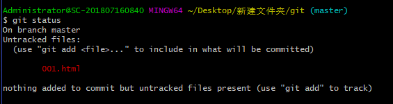
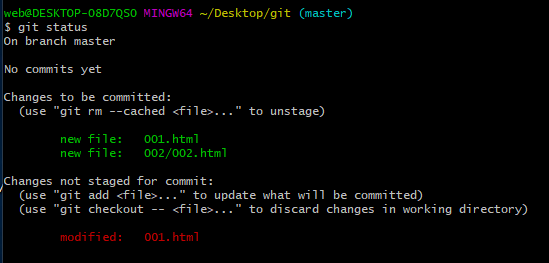
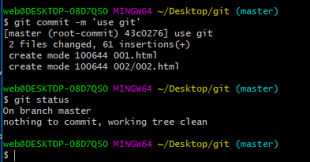
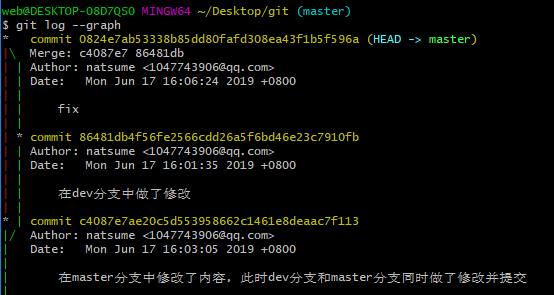
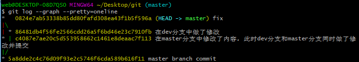
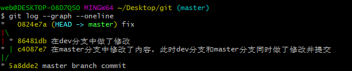

# A note for learn git  

## ERRORS  

+ `Please enter a commit message to explain why this merge is necessary.`  
    git 在pull或者合并分支的时候有时会遇到这个界面。  
    基本原因是因为本地库的代码跟远程库有冲突需要合并,  
    处理方法  
    1. 按键盘字母 i 进入insert(输入)模式,编辑必要的注释 说明合并的原因,编辑的内容会在第一行显示,也可不修改  
    1. 修改最上面那行黄色合并信息,可以不修改  
    1. 按"Esc"  
    1. 输入":wq",按回车键即可  

+ <code> ssh: connect to host github.com port 22: Connection timed out  
fatal: Could not read from remote repository.  
Please make sure you have the correct access rights  
and the repository exists.</code>  

    利用ssh 及命令`git clone...`下载GitHub上的仓库报上述错误，且ssh公钥已在GitHub保存，经 {==`ssh -T git@github.com`==}测试ssh是否配置成功，同样报`ssh: connect to host github.com port 22: Connection timed out`错误，错误提示中有`22 端口`，暂未找到端口相关解决方式，可行解决方式：`Clone with HTTP`,命令`git clone https://github.com/Natsume0728/markdown.git`即可正常下载。  

## git文件状态`git status`  

1. 在本地git仓库中新建 `001.html`文件 `002`目录  
  
文件001.html状态为:==Untracked files==(未监视)  
若新建目录为空，`git.status`命令不会将这个目录显示在`Untracked files`中。  
1. `git add [filename]or[dirname/]`后文件状态：==Changes to be committed==,==绿色字体显示new file==:  
  
1. 修改文件001.html中的内容后执行`git status`命令，001.html文件状态为：==Changes not staged for commit==(文件已执行过`add`操作，理解为已纳入跟踪后做了修改，而未将修改后的文件提交到缓存区)，==红色字体显示modified==  
  
1. commit操作后  
  
1. commit操作后再次修改文件内容  
  
同样显示==Changes not staged for commit==状态，同样标为==红色modified==。  

## git命令（含Linux命令）  

+ `ssh-keygen -t rsa -C <email>`创建SSH KEY  
+ `mkdir <dir>`创建目录(Linux)  
+ `cd <dirn>`进入目录(Linux)  
+ `pwd`显示当前目录  
+ `vim <file>`在编辑器中修改文件内容  
    + <kbd>i</kbd>插入(进入编辑器编辑文件)  
    + <kbd>Ese</kbd>退出编辑器  
    + `:wq`保存并退出  

***

+ `git init`将当前仓库变成Git可以管理的本地仓库  
+ `git add <file>or<dir/>`  
+ `git status`查看文件状态，冲突文件  
+ `git commit -m <message>`  
+ `git config [--global][--system] user.email '...'`引号可省略  
+ `git config [--global][--system] user.name '...'`引号可省略  

***

+ `git remote add <远程仓库的本地名称> url`  
+ `git remote add <origin> url`关联远程库  
+ `git push -u <origin> master`把本地库内容推送到远程，用`git push`命令，实际上是把当前分支`master`推送到远程，首次推送时，远程库为空，加上`-u`==参数==，Git不但会把本地的`master`分支内容推送到远程新的`master`分支，还会把本地的`master`分支和远程的`master`分支关联起来，在以后推送或拉取的时候就可以简化命令。  
+ `got push origin master`本地提交后，把本地`master`分支的最新修改推送到远程库  
+ `git clone url`克隆远程仓库，<mark>该命令不要求在`init`后的目录中使用，本地非git初始化目录也可使用。</mark>  

***

+ `git checkout -b dev`创建并切换到新分支dev
+ `git branch dev`创建新分支dev
+ `git checkout dev`切换到新分支
+ `git branch`查看当前分支
+ `git merge dev`合并指定分支(dev)到当前分支
+ `git branch -d dev`删除分支dev
+ `git log --graph`git点线树  
  
    + `git log --graph --pretty=oneline`git点线树单行显示，==commit id完整显示==。  
  
    + `git log --graph --oneline`git点线树单行显示，==commit id简写==。  
  
    + `git log --graph --oneline --all`==增加参数`--all`可显示所有分支的点线树==。
    + `gitk`内置图形化工具，`git log`命令的可视化版本  ，同样可以加==参数`--all`。==  
[转至:git log命令的详细介绍](https://git-scm.com/book/zh/v1/Git-%E5%9F%BA%E7%A1%80-%E6%9F%A5%E7%9C%8B%E6%8F%90%E4%BA%A4%E5%8E%86%E5%8F%B2)  