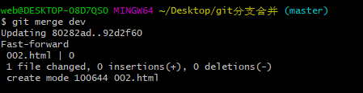
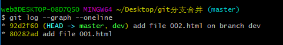
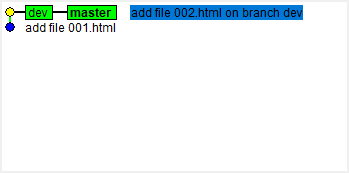
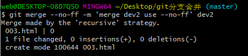
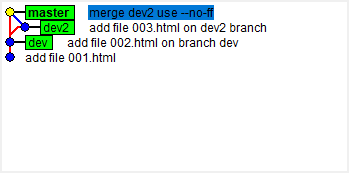
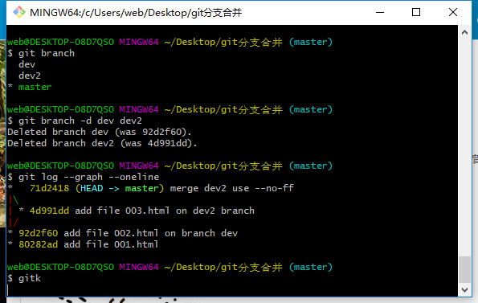
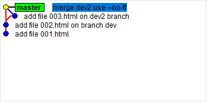

# git中分支合并Fast-forward和--no-ff模式

+ Fast-forward 快进模式
    1. 在master分支上新建文件001.html后commit。
    1. 新建并转到dev分支，`git checkout -b dev`。
    1. 在dev分支上新建文件002.html后commit。
    1. 转回master并合并分支dev，`git merge dev`。

git点线树显示如下`git log --graph --oneline`：

gitk工具显示如下：

+ --no-ff 禁用快进模式
    1. 新建并转到dev2分支，`git checkout -b dev2`。
    1. 在dev2分支上新建文件003.html后commit。
    1. 转回master并使用--no-ff模式合并分支dev2，`git merge --no-ff -m <message> dev2`

git点线树显示如下`git log --graph --oneline`：

gitk工具显示如下：

***

tip:

+ 快进模式合并分支命令`git merge dev`,git是把`master`指向`dev`当前的commit(且可以看出此种模式的merge并没有产生新的commit)就完成了合并，所以速度很快，但是有缺点，删除分支后，会丢掉分支信息，==后期从分支历史上看不出曾经做过合并==;
+ 禁用快进模式合并分支命令`git merge --no-ff -m <message> dev2`，此种模式git会在merge时生成一个新的commit(所以需要-m参数),这样，==删除分支后，从分支历史上仍可以看出曾经做过合并==。
git点线树和gitk工具显示如下：

